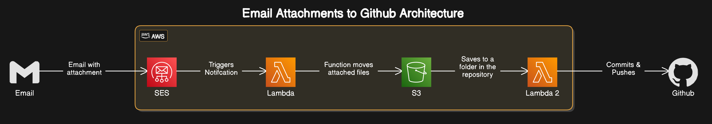

## Introduction

Objective
To be able to commit files to github through email. The idea for this came from the hassle I felt from sending PDFs to myself then downloaded and commiting from my PC.
The Process is shown through the diagram below.

> This project uses AWS S3, Lambda, SES.
> 

Challenges:

1. Getting SES to connect to Lambda
2. Getting S3 and Github to sync with each other. Both ways.
3. How to get SES to download the attachment files to my S3 bucket.

Update 4/4:
I showed my professor what I was working on and he suggested that I overengineered a bit. Since my goal is to simply get my notes on github, I should skip the moving the files to S3 all together and make a Lambda function to commit and push these files to github.